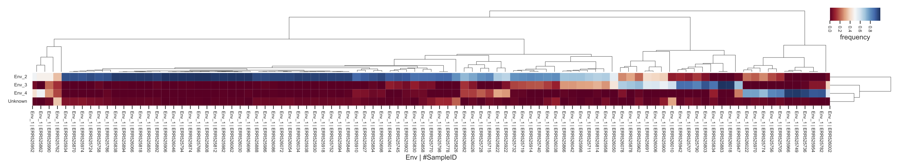

# Tutorial 
**Note**: This guide assumes you have installed QIIME2 using one of the procedures in the [install documents](https://docs.qiime2.org/2019.7/install/) and have installed FEAST.


## Introduction 

In this tutorial you will learn how to perform and interpert microbial source tracking through QIIME2. 

FEAST is a highly efficient Expectation-Maximization-based method that takes as input a microbial community (called the sink) as well as a separate group of potential source environments (called the sources) and estimates the fraction of the sink community that was contributed by each of the source environments. By virtue of these mixing proportions often summing to less than the entire sink, FEAST also reports the potential fraction of the sink attributed to other origins, collectively referred to as the unknown source. The statistical model used by FEAST assumes each sink is a convex combination of known and unknown sources. FEAST is agnostic to the sequencing data type (i.e., 16s rRNA or shotgun sequencing), and can efficiently estimate up to thousands of source contributions to a sample. In this tutorial we applied FEAST to two real datasets in order to demonstrate the utility of microbial source tracking methods across different contexts.  


### Example 1
We first use FEAST in the context of a time-series.  Using FEAST for time-series analysis offers a quantitative way to characterize developmental microbial populations, such as the infant gut. In this context, we can leverage previous time-points and external sources to understand the origins of a specific, temporal community state. For instance, we can estimate if taxa in the infant gut originate from the birth canal, or if they are derived from some other external source at a later time point. To demonstrate this capability, we used a subset of the longitudinal data from Backhed et al. 2015, which contains gut microbiome samples from infants as well as from their corresponding mothers. In this analysis, we treated samples taken from the infants at age 12 months as sinks, considering respective earlier time points and maternal samples as sources.


We provide a dataset for this example. Download the demo files <a href="https://github.com/cameronmartino/FEAST/tree/FEAST_beta/q2_FEAST/tests/data">here</a>.

To run FEAST with this example data:

```shell
qiime feast microbialtracking \
  --i-table data/backhed/table-multi.qza \
  --m-metadata-file data/backhed/metadata-multi.qza \
  --p-environment-column Env \
  --p-source-sink-column SourceSink \
  --p-source-ids Source \
  --p-sink-ids Sink \
  --p-shared-id-column host_subject_id \
  --p-em-iterations 1000 \
  --p-different-sources \
  --o-mixing-proportions data/backhed/mixing-proportions.qza 
```
```Saved FeatureTable[Frequency] to: data/backhed/tackingresults.qza```

The output is an S1 by S2 matrix P, where S1 is the number sinks and S2 is the number of sources (including an unknown source). Each row in matrix P sums to 1.

We can visualize these results using a heatmap in QIIME2.

```shell
qiime feature-table heatmap\
  --i-table data/backhed/mixing-proportions.qza  \
  --m-metadata-file data/backhed/metadata-multi.qza \
  --m-metadata-column Env \
  --p-no-normalize\
  --p-color-scheme RdBu\
  --o-visualization data/backhed/heatmap.qzv
```
```Saved FeatureTable[Frequency] to: data/backhed/heatmap.qzv```

 
