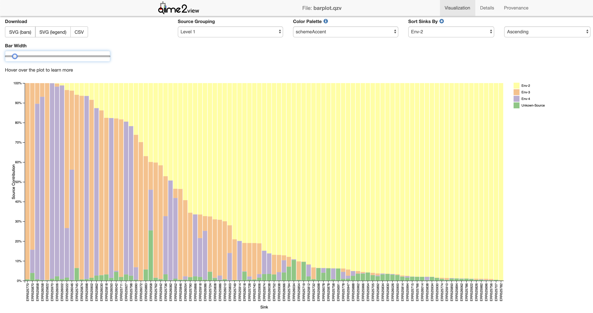

# FEAST QIIME 2 Plugin


One critical challenge in analyzing microbiome communities is due to their composition; each of them is typically comprised of several source environments, including different contaminants as well as other microbial communities that interacted with the sampled habitat. To account for this structure, we developed FEAST (Fast Expectation-mAximization microbial Source Tracking), a ready-to-use scalable framework that can simultaneously estimate the contribution of thousands of potential source environments in a timely manner, thereby helping unravel the origins of complex microbial communities. Specifically, FEAST is quantifying the fraction, or proportion, of different microbial samples (sources) in a target microbial community (sink), by leveraging its structure and measuring the respective similarities between a sink community and potential source environments. For more details see Shenhav et al., Nature Methods 2019 (https://www.nature.com/articles/s41592-019-0431-x).

## Installation

If you have not already done so, activate your QIIME environment.

```shell
source activate qiime2-20xx.x
```
Next we will need to ensure some dependancies are installed.

```shell
conda install -c bioconda -c conda-forge -c r bioconductor-phyloseq r-devtools r-magrittr r-dplyr r-vgam r-tidyr r-vegan r-reshape2 r-rcpp r-rcpparmadillo r-gridextra r-ggplot2 r-ggthemes
```

Now we will install FEAST and the q2-plugin.

```R
# the main FEAST package
> R
> devtools::install_github("cozygene/FEAST")
> quit()
```
```shell
# the QIIME2 plugin
pip install git+https://github.com/cozygene/FEAST.git
```

## Tutorial

A QIIME2 tutorial is available [here](https://github.com/cozygene/FEAST/q2_feast/tutorials/DIABIMMUNE.md)

## The q2-FEAST commands

The QIIME 2 implementation of FEAST contains two steps.

1. The first step, called `microbialtracking`, performs the tracking and
   outputs a table of mixing proportions of the semantic type
   `FeatureTable[Frequency]`.

2. The second command, `barplot`, takes the output from the previous step and
   creates an interactive stacked barplot of source-contributions to each sink.

   Note that this command just creates a visualization from a single
   mixing proportions table. However, if you have lots of samples in your
   proportions table, you can create multiple visualizations by splitting up
   your proportions table using the `qiime feature-table filter-samples` command
   in QIIME 2.



## Setting up a development environment for q2-FEAST

This section contains instructions on how to set up a development environment
of q2-FEAST, at least as of writing.

1. Activate your QIIME 2 conda environment.

2. Fork this git repository, then clone your fork to your system.

3. Install the R dependencies as shown in the installation instructions at the
   top of this file (`conda install -c bioconda ...`).
   However, don't install FEAST using `devtools::install_github()` quite yet.

4. Using your favorite shell (e.g. bash), navigate into the folder this fork
   was installed into (the folder that contains this `README.md`).

5. Open up R, then run the
   [following command](https://stackoverflow.com/a/34513358/10730311):
   ```r
   > devtools::install()
   ```
   This will install the FEAST R package from the current directory.
   If you get prompted to update package versions, it's probably fine to do
   that.

6. We've installed FEAST's R prerequisites, as well as the actual FEAST R
   package, but we haven't installed the Python infrastructure needed to
   get this working with QIIME 2 yet. Let's do that!

   Exit out of R back to the shell. Run the following command:
   ```bash
   $ pip install -e .[dev]
   ```
   This will install the q2-FEAST package from the current directory, along
with its `dev` requirements (which are needed to run its tests).

7. We're almost done! Run the following commands to test that FEAST and
   q2-FEAST are properly installed:
   ```bash
   $ qiime dev refresh-cache
   $ make test
   ```
   If these commands succeed, you should be good to start developing!
